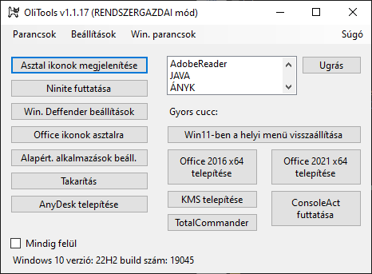

# OliTools

## Mi ez?

Ezt a programot saját felhasználásomra készítettem, de megosztom másokkal is, hátha hasznosnak találják.
Munkám során elég sokszor telepítek újra gépeket ezért próbáltam ezzel a programmal pár lépést automatizálni.
Persze nyilván lehetne olyan image fájlt is készíteni ami már bizonyos dolgok be vannak állítva...

## Miért olyan nagy a fájl mérete?

Azért mert úgymond bele van integrálva a programba a szükséges függőségek amit a .NET6 tartalmaz, ezáltal úgymond portable változat készült belőle.
Lehetne persze sokkal kisebb is a méret pár MB, de akkor előtte telepíteni kellene a .NET6 futtatókörnyezetet és mondjuk egy újonnan telepített Windows 10 vagy 11-en nem is biztos, hogy a .NET6 keretrendszer telepítésével kezdenél.

## Jó lenne pl. olyan gomb is, hogy egyből kikapcsolja a Defender funkcióit. Lehetne?

Biztos hogy leheten, de bonyolúlt. Nem egyszerű ezt lekódolni, úgyhogy ilyen nincs is.

## Ismert hibák:
Biztos van :)

## _Itt töltheted le:_

## v1.1.32
[https://drive.google.com/file/d/1MvF3cOWquaeND4Xr2ZYyvZ8TAnKWZUMU/view](https://drive.google.com/file/d/1MvF3cOWquaeND4Xr2ZYyvZ8TAnKWZUMU/view)
